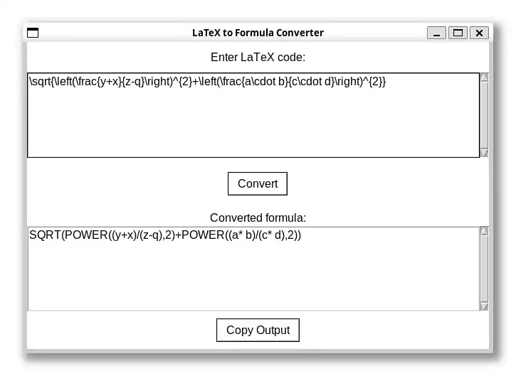

# LaTeX2Formula

*See also: [LaTeX2Formula Web version](https://github.com/krzsztfwtk/LaTeX2FormulaWeb)*

convert LaTeX math expressions into formula code for SQL, Excel, C++, etc.



LaTeX2Formula is a Python graphical program that converts LaTeX mathematical expressions into formula code for various platforms such as SQL, Excel, or C++. By default, it translates common constructs like fractions, square roots, and exponentiation into SQL-style function calls (using `POWER` and `SQRT`), but you can easily customize these settings to suit your needs.

This tool is particularly useful when combined with OCR applications such as [LaTeX-OCR](https://github.com/lukas-blecher/LaTeX-OCR). For example, you can extract LaTeX formulas from Wikipedia images and then convert them into SQL code with LaTeX2Formula.

## Features

- **Graphical Interface:** User-friendly Tkinter GUI for easy input and copyable output.
- **Formula Conversion:** Supports conversion of fractions (`\frac{...}{...}`), square roots (`\sqrt{...}`), and exponentiation (`^{...}`).
- **Customizable Output:** Change function names by editing the variables in `latex2formula.py`:
  
  ```python
  POWER_FUNCT_NAME = "POWER"
  SQRT_FUNCT_NAME = "SQRT"
  ```

  This makes it simple to target different environments, such as Excel or C++.
- **Clipboard Integration:** Quickly copy the converted formula to your clipboard with a single click.

## Usage

Execute the script:

```bash
python your_script_name.py
```

Paste your LaTeX formula into the input field. Click the **Convert** button to transform the LaTeX code into formula code. Use the **Copy Output** button to copy the resulting code to your clipboard for further use.

## Example

For instance, given the input:

```latex
\sqrt{\left(\frac{y+x}{z-q}\right)^{2}+\left(\frac{a\cdot b}{c\cdot d}\right)^{2}}
```

the output will be:

```sql
SQRT(POWER((y+x)/(z-q),2)+POWER((a* b)/(c* d),2))
```

## Customization

By default, the tool uses:

```python
# latex2formula.py

POWER_FUNCT_NAME = "POWER"
SQRT_FUNCT_NAME = "SQRT"
```

If you prefer different function names (for example, `pow` in C++ or Excel functions), simply edit these variables at the beginning of the script.

## Limitations

This tool supports only a limited subset of LaTeX syntax. Currently, it can handle multiplication expressed with `\cdot`, fractions (`\frac{...}{...}`), exponentiation (`^{...}`), addition, subtraction, and the use of brackets for grouping. More advanced constructs, such as trigonometric functions (e.g., sin, cos, tan), derivatives, and integrals, are not supported.
